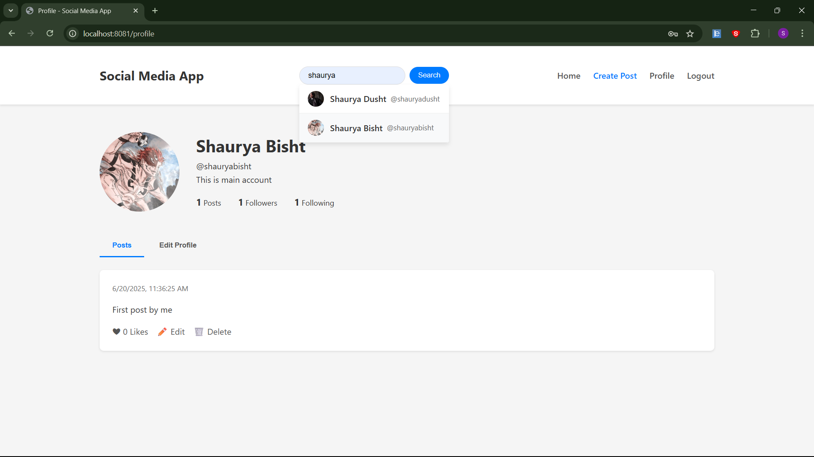
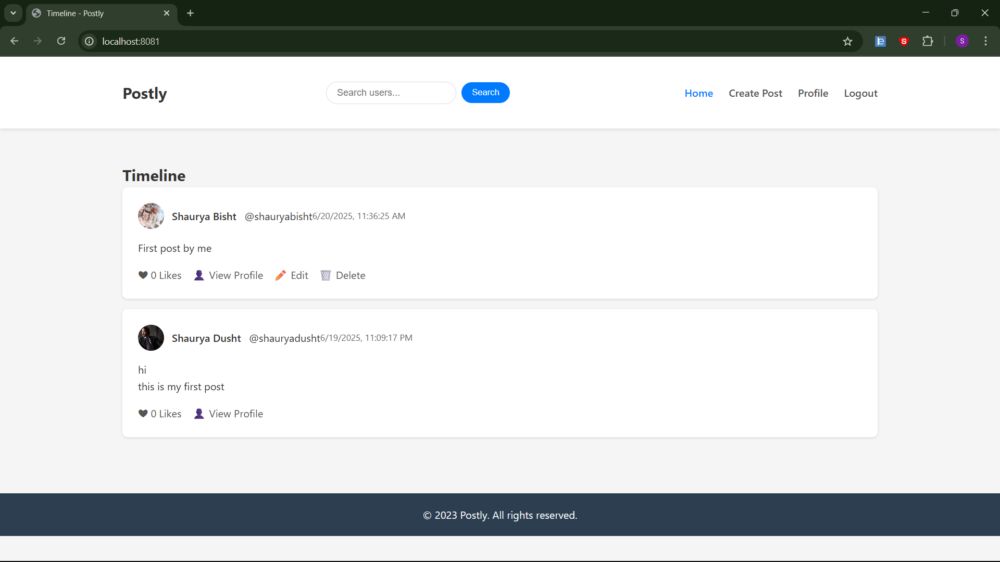
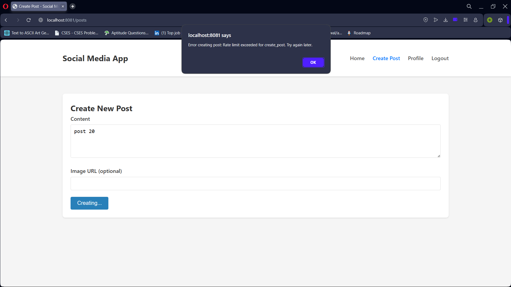
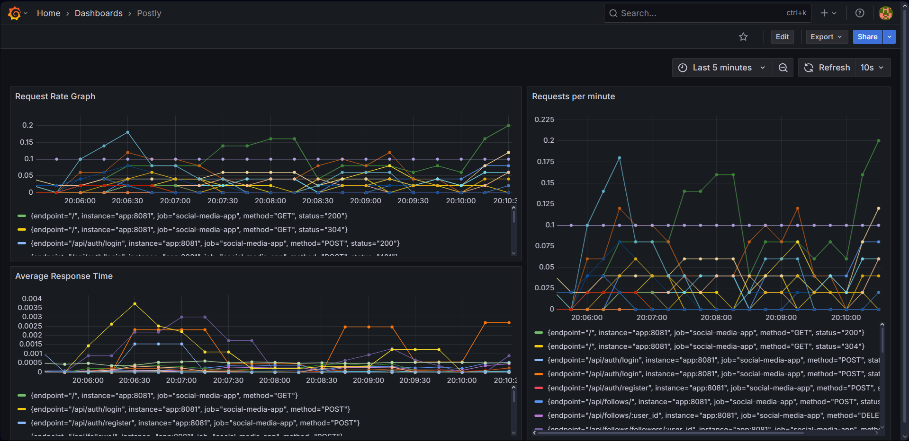

# Postly

Postly is a Twitter-inspired micro-blogging platform built with Go, PostgreSQL, and Redis. It includes features like JWT authentication, timelines, likes, follows, rate limiting, caching, monitoring with Grafana, and a responsive web interface for a smooth user experience.

## Quick Start

### 🚀 Prerequisites

Make sure you have the following installed to run **Postly** smoothly:

`🔧 Go 1.23+` &nbsp;&nbsp;`🐳 Docker` &nbsp;&nbsp;`🐘 PostgreSQL` &nbsp;&nbsp;`⚡ Redis`


### Local Setup using Docker

1. Clone the repository:
   ```bash
   git clone https://github.com/ShauryaDusht/go-social-media-app
   ```

2. Navigate to the project directory:
   ```bash
   cd go-social-media-app
   ```
3.  Build the Docker images:
      ```bash
      docker-compose build
      ```

4. Start the services:
   ```bash
   docker-compose up
   ```

5. Access the application at `http://localhost:8081`

6. Access Grafana for monitoring at `http://localhost:3000`

### Docker Commands
- Start services: `docker-compose up -d`
- Stop services: `docker-compose down`
- View logs: `docker-compose logs -f`
- Rebuild: `docker-compose up --build`
- Access database shell: `docker exec -it social_postgres psql -U admin -d social_media`

# Screenshots
Profile Page

Timeline Page

Rate Limiting in Action

Grafana Dashboard for API Metrics


---
# Project Status

This section outlines the progress and current status of the Postly.

## Phase 1: Environment Setup - [✅DONE]
Set up environment, Docker, Project directory setup

## Phase 2: Models, Database, and API Routes - [✅DONE]
Add models, Set up PostgreSQL Redis locally, Define REST API routes, Make migrations

## Phase 3: Authentication and UI - [✅DONE]
Add login, signup, logout, JWT based only, Add basic UI for login, signup, and posts

## Phase 4: Post APIs - [🚧IN PROGRESS]
- CRUD APIs for posts - [✅DONE]
- Like/unlike posts - [🐞BUG] : re-liking a post gives error
- User timeline logic - [✅DONE]

## Phase 5: Follow System and Caching - [✅DONE]
Follow System, Caching Timeline, User profile search functionality

## Phase 6: Rate Limiting - [✅DONE]
Rate limiting for APIs, Use token bucket or fixed window (via Redis), Per user or IP — apply on post creation, likes, follow, etc

## Phase 7: Deployment and CI/CD - [✅DONE]
Dockerized the application

## Phase 8: Monitoring - [✅DONE]
Prometheus metrics, Grafana dashboard

## Phase 9: Testing - [🛠️TODO]
- Testing using go scripts

## Additional Features - [🛠️TODO]
- Add feature to see followers and following list of a user
- Improve search functionality by adding some fuzzyness
- Add pagination to posts (20 per page)
- Add comments to posts

---

# Contributing
We welcome contributions to Postly! If you have suggestions, bug reports, or feature requests, please open an issue or submit a pull request.

---
# Directory Structure

To generate directory tree structure, you can use the `tree.py` script. It will display the current directory structure in a tree format. Reference link: [directory_tree](https://pypi.org/project/directory-tree/)

```bash
pip install directory_tree
```

```bash
python tree.py
```